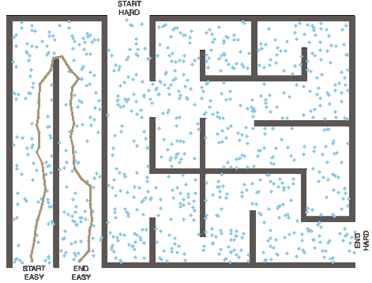
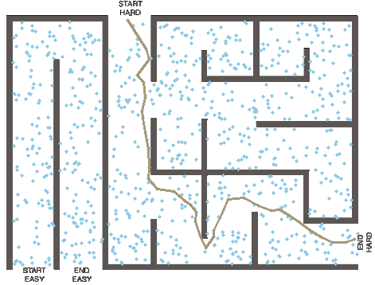

# Path Planning in Maze using PRM and A* Algorithm

This project demonstrates path planning in a maze using Probabilistic Roadmap (PRM) and the A* algorithm. The maze is represented as an image, from which obstacles are extracted and a roadmap is generated. A* algorithm is used to find paths between predefined start and end points within the maze.

### Roadmap Generation

- The maze image is loaded and converted to grayscale.
- Obstacles are identified and added to the roadmap.
- Random points are generated within specified regions to form nodes in the roadmap.
- Nearest neighbors among nodes are connected if there are no obstacles in between.

### Path Planning with A*

- A* algorithm is applied to find the shortest path between predefined start and end points in the maze.
- Paths are visualized on the maze image, showing both the lines connecting nodes in the roadmap and the final path found.

## Results

After running the script, the following images will be saved in the project directory:

- `Start_Easy.png`: Path found from the "easy" start position.
- `Start_Hard.png`: Path found from the "hard" start position.

### Example Output

